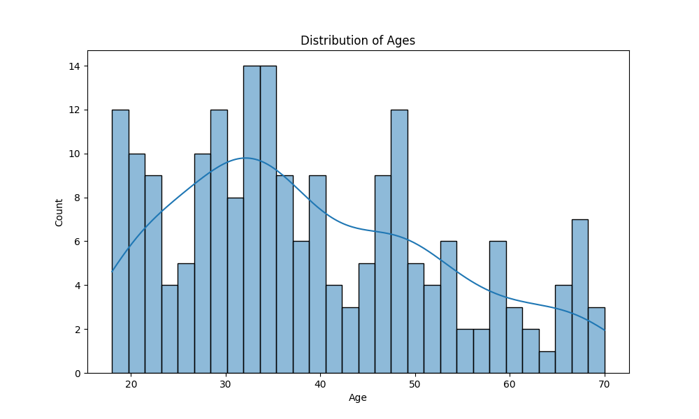
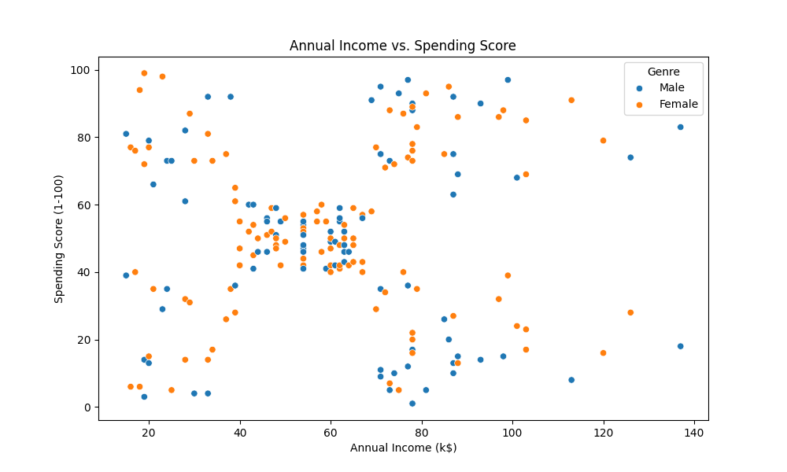
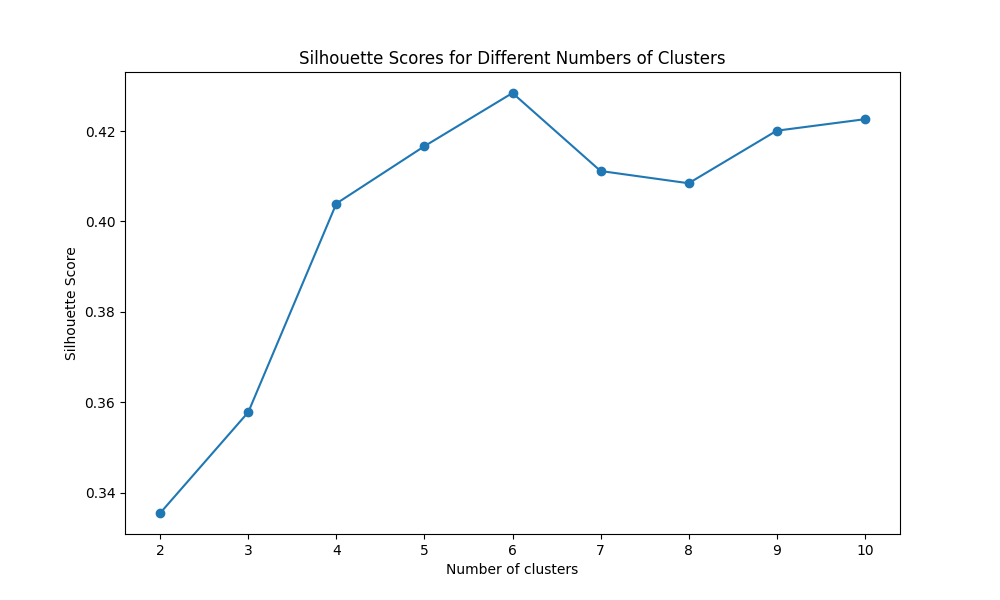

# 🌟 Advanced Customer Segmentation

This project leverages k-Means clustering and Logistic Regression to segment customers based on their shopping data, aiming to enhance targeted marketing strategies.

---

## 🎯 Project Overview

### Goal
Implement, train, and evaluate machine learning models on customer data to achieve accurate predictions and determine the best-performing model.

---

## ⚙️ Steps and Implementation

### 1. Download and Load Dataset
- **Libraries Used:**
  - `pandas` for data manipulation and analysis
  - `numpy` for numerical operations
  - `scikit-learn` for machine learning models and preprocessing
  - `matplotlib.pyplot` and `seaborn` for data visualization

### 2. Visualize Data Distribution
- **Graphs:**
    
    

  

### 3. Data Preparation and Scaling
- Selected necessary columns (age, annual income, spending score)
- Scaled data using `StandardScaler`

### 4. Determine Optimal Number of Clusters
- Used Silhouette Score to find optimal clusters (2-10)
- **Graph:**
  
  

### 5. k-Means Clustering
- Applied k-Means with 6 clusters to scaled data

### 6. Logistic Regression and Performance Metrics
- 5-fold cross-validation with Logistic Regression

---

## 📊 Results

### Visuals and Performance
- **Optimal number of clusters:** 6
- **Accuracy scores from 5-fold cross-validation:** [0.925, 1.0, 1.0, 1.0, 0.9]
- **Mean accuracy:** 0.965

### Performance Metrics
| Metric              | Value                |
|---------------------|----------------------|
| Accuracy            | 0.995                |
| F1 Score            | 0.9949991780371527   |
| Precision           | 0.995125             |
| Recall              | 0.995                |
| Mean Squared Error  | 0.005                |
| R-Squared           | 0.9979227038087226   |

### Confusion Matrix

[[23 0 0 0 0 0]
[ 0 45 0 0 0 0]
[ 0 0 33 0 0 0]
[ 0 0 0 38 1 0]
[ 0 0 0 0 39 0]
[ 0 0 0 0 0 21]]

### Conclusion
Combining k-Means clustering and Logistic Regression effectively segmented customers, achieving high accuracy and well-defined clusters. This approach is valuable for targeted marketing strategies.

---

## 🚀 Usage

1. Clone the repository:
    ```bash
    git clone https://github.com/MarawanEldeib/Advanced_Customer_Segmentation.git
    ```

2. Navigate to the project directory:
    ```bash
    cd Advanced_Customer_Segmentation
    ```

3. Run the Jupyter Notebook:
    ```bash
    jupyter notebook Assignment_1_Clustering.ipynb
    ```

4. Download the dataset:
    ```bash
    wget [URL_of_the_dataset]
    ```

---

## 📦 Libraries
To replicate this project, ensure you have the following libraries installed:
```bash
pip install pandas numpy scikit-learn matplotlib seaborn
